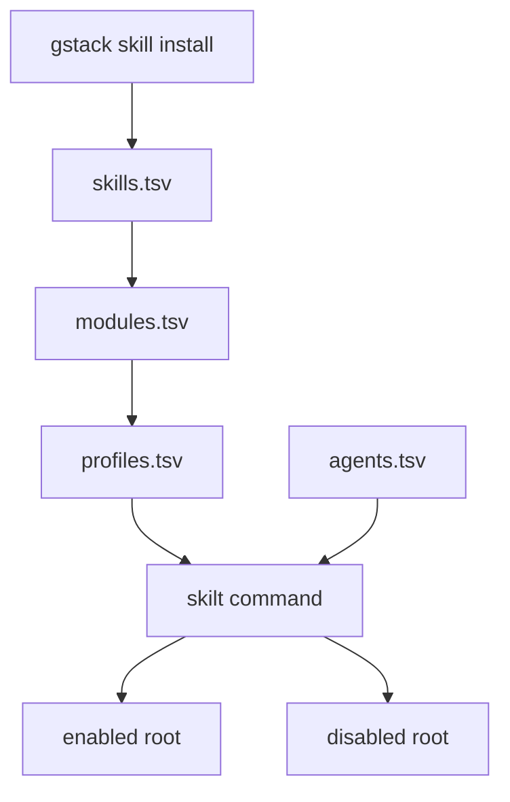
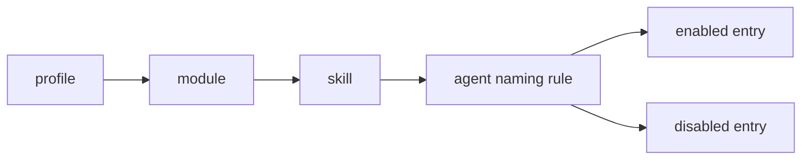

# skilt

[中文文档](./README.zh-CN.md)

`skilt` is a small Bash CLI for toggling **gstack skill visibility** across multiple coding agents. Instead of editing the real gstack skill source, it moves each agent-visible entry between an enabled directory and a disabled directory. That makes profile switching fast, reversible, and safe.

It is designed for machines that run more than one coding agent, or for users who want different skill sets for different workflows such as backend development, GUI work, or release operations.

## Introduction

When every installed skill is always visible, agent capability lists grow, prompt context gets noisier, and workflow-specific tools become harder to manage. `skilt` solves that with a simple configuration model:

- `skills.tsv` defines the global skill inventory.
- `modules.tsv` groups skills by function.
- `profiles.tsv` groups modules by role or project stage.
- `agents.tsv` maps logical skills to concrete agent directories and naming styles.

This lets you say:

- "use my backend profile"
- "turn off iOS skills for Codex only"
- "preview a release profile without moving any files"

## Features

- Multi-agent support for Codex, Claude Code, and OpenCode
- Profile-driven skill switching
- Module-level and single-skill toggles
- Dry-run previews before any filesystem move
- Config validation with install consistency checks
- No mutation of gstack source skills

## Install

### Requirements

- Bash
- Standard Unix tools: `awk`, `grep`, `find`, `mv`, `sort`
- A local gstack skill install, typically at `~/gstack/.agents/skills`

### Clone and run

```bash
git clone <your-repo-url> skilt
cd skilt
chmod +x skilt
./skilt status
```

### Install to custom directories

If you want a standalone installed command instead of running from the clone:

```bash
./scripts/install-skilt.sh --bin-dir ~/scripts --config-dir ~/.config/skilt
~/scripts/skilt status
```

This installs:

- a wrapper at `<bin-dir>/skilt`
- the real runtime at `<config-dir>/skilt/skilt`
- the bundled config at `<config-dir>/skilt/gstack-skill-config`

If `--bin-dir` or `--config-dir` is omitted, the installer prompts for it.

### Optional: add to PATH

```bash
mkdir -p ~/.local/bin
ln -sf "$(pwd)/skilt" ~/.local/bin/skilt
skilt status
```

### Optional: custom config or skill roots

If your config directory or gstack install is not in the default location:

```bash
export SKILT_CONFIG_DIR=/path/to/gstack-skill-config
export SKILT_GSTACK_SKILLS_DIR=/path/to/gstack/.agents/skills
```

## Uninstall

If you want all configured skills restored before removing the tool:

```bash
./skilt all-on
```

Then remove the binary link or repository clone:

```bash
rm -f ~/.local/bin/skilt
rm -rf /path/to/skilt
```

If you used the installer, remove both the wrapper and installed runtime:

```bash
rm -f /path/to/bin/skilt
rm -rf /path/to/config-root/skilt
```

`skilt` does not uninstall or modify gstack itself.

## Usage

### Quick examples

```bash
./skilt status
./skilt count
./skilt diff
./skilt use backend-indie -n
./skilt use backend-indie
./skilt off ios
./skilt on design-html
./skilt off design -a claude
./skilt on web-qa -a codex
./skilt doctor
```

### Commands

| Command | What it does |
| --- | --- |
| `status [-a agent]` | Show enabled and disabled roots and counts |
| `count [-a agent]` | Show configured totals and per-agent enabled/disabled totals |
| `diff [-a agent]` | Compare config vs local install and print current enabled/disabled skill names |
| `use <profile> [-a agent] [-n]` | Apply a profile by enabling only its required skills |
| `on <module\|skill> [-a agent] [-n]` | Enable a module or a single skill |
| `off <module\|skill> [-a agent] [-n]` | Disable a module or a single skill |
| `all-on [-a agent] [-n]` | Enable all configured skills |
| `all-off [-a agent] [-n]` | Disable all configured skills |
| `reset [-a agent] [-n]` | Alias for `all-on` |
| `doctor` | Validate config structure and local install state |
| `list agents\|modules\|profiles\|skills` | Print configured entities |

### Dry-run mode

Use `-n` or `--dry-run` to preview moves:

```bash
./skilt use gui-stage -n
./skilt off design -a codex -n
```

Dry-run prints the planned `mv` operations and does not change the filesystem.

### Target a single agent

```bash
./skilt use backend-indie -a codex
./skilt off design -a claude
./skilt on web-qa -a opencode
```

## Architecture

### High-level flow



### Runtime model

`skilt` treats the filesystem entry point as the control plane. A logical skill name is resolved from profile to module to skill, then mapped into an agent-specific entry name and moved between enabled and disabled roots.



### Real directory behavior

```text
Codex
  ~/.codex/skills/gstack-investigate
  <-> ~/.codex/skills.disabled/gstack/gstack-investigate

Claude Code
  ~/.claude/skills/investigate
  <-> ~/.claude/skills.disabled/gstack/investigate

OpenCode
  ~/.config/opencode/skills/gstack-investigate
  <-> ~/.config/opencode/skills.disabled/gstack/gstack-investigate
```

### Why this is safe

- It moves only visible entry points.
- It does not edit `SKILL.md` contents.
- It does not rewrite gstack source directories.
- It can preview changes before applying them.
- It is easy to reverse with `all-on` or `reset`.

## Configuration Model

All configuration lives in [`gstack-skill-config/`](./gstack-skill-config/).

### `agents.tsv`

Defines where each agent reads enabled skills from, where disabled skills are stored, and how logical names map to actual entries.

```text
codex   ~/.codex/skills                    ~/.codex/skills.disabled/gstack             gstack-prefix
claude  ~/.claude/skills                   ~/.claude/skills.disabled/gstack            plain
opencode ~/.config/opencode/skills         ~/.config/opencode/skills.disabled/gstack   gstack-prefix
```

Entry styles:

- `gstack-prefix`: `investigate -> gstack-investigate`
- `plain`: `investigate -> investigate`

### `skills.tsv`

Defines the full known skill inventory. This is the source of truth for bulk operations such as `all-on`, `all-off`, `count`, and `diff`.

### `modules.tsv`

Maps a functional module to one or more skills.

```text
design      design-html
design      design-review
core-debug  investigate
```

Each skill also has an implicit self-module, so `./skilt on design-html` works even if `design-html` only appears under a broader module.

### `profiles.tsv`

Maps a role or stage profile to one or more modules.

```text
backend-indie   core-debug
backend-indie   product
gui-stage       design
release-stage   deploy
```

Applying a profile enables the skills required by that profile and disables the rest of the configured inventory.

## Repository Layout

```text
.
├── skilt
├── scripts/
│   └── test-skilt.sh
├── gstack-skill-config/
│   ├── agents.tsv
│   ├── skills.tsv
│   ├── modules.tsv
│   ├── profiles.tsv
│   └── README.md
├── gstack_introduce.md
└── AGENTS.md
```

## Validation and Testing

### Run the regression suite

```bash
./scripts/test-skilt.sh
```

The test script builds isolated temporary fixtures and verifies:

- profile application
- module and skill toggles
- dry-run behavior
- full reset behavior
- `doctor` warnings and failures
- `count` and `diff` output shape

### Run config checks

```bash
./skilt doctor
```

`doctor` checks:

- duplicate skills in `skills.tsv`
- unknown skill references in `modules.tsv`
- unknown module references in `profiles.tsv`
- installed skills missing from config
- configured skills missing from local install
- skills that only have an implicit self-module
- enabled/disabled conflicts for the same agent entry

## Typical Workflows

### Backend-focused session

```bash
./skilt use backend-indie
```

### GUI-focused session

```bash
./skilt use gui-stage
```

### Release preparation

```bash
./skilt use release-stage -n
./skilt doctor
./skilt use release-stage
```

## Design Notes

This project is intentionally small. The main script:

- parses config with `awk`
- filters configured entities with `sort`, `grep`, and shell loops
- expands agent-specific paths
- resolves profile and module membership
- moves entries with `mv`

That small surface area is deliberate. The tool is easy to audit, easy to test, and easy to adapt for new agents.

## Related Files

- Contributor guide: [`AGENTS.md`](./AGENTS.md)
- Config usage notes: [`gstack-skill-config/README.md`](./gstack-skill-config/README.md)
- Background notes: [`gstack_introduce.md`](./gstack_introduce.md)
