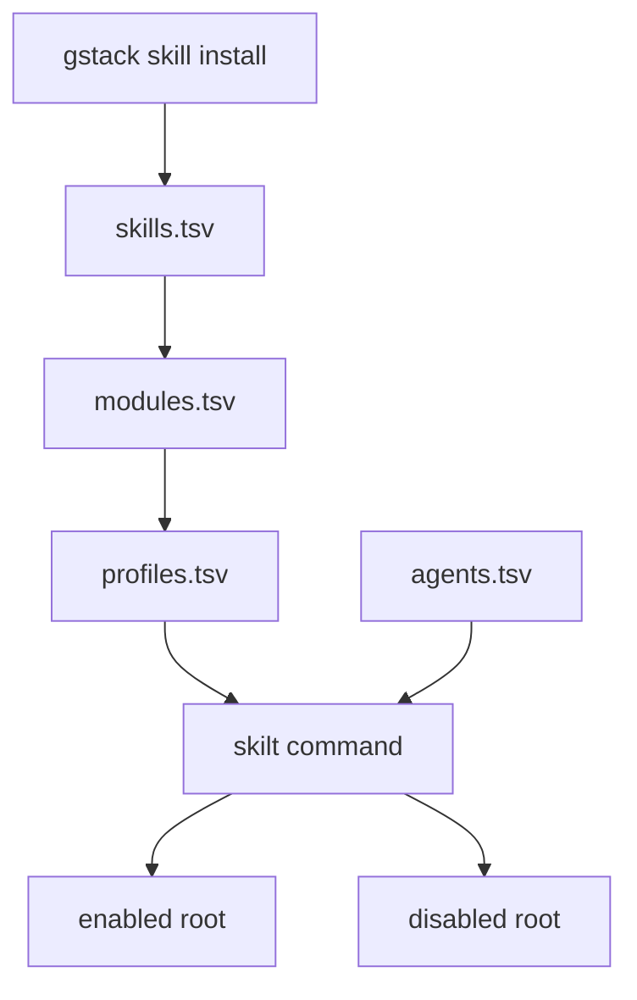
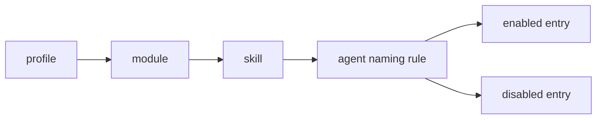

# skilt

[English](./README.md)

`skilt` 是一个小型 Bash CLI，用来在多个 coding agent 之间切换 **gstack skills 的可见性**。它不修改真正的 gstack skill 源目录，而是把各个 agent 可见的 skill 入口在启用目录和禁用目录之间移动，因此切换画像很快、可回退、也更安全。

这个工具适合一台机器上同时运行多个 coding agent，或者你希望根据不同工作流切换不同 skill 集，例如后端开发、GUI 阶段、发版操作等。

## 项目介绍

当所有已安装 skill 都始终可见时，agent 的能力列表会越来越长，提示上下文会更嘈杂，工作流相关工具也更难管理。`skilt` 用一套简单的配置模型来解决这个问题：

- `skills.tsv` 定义全局 skill 清单。
- `modules.tsv` 按功能对 skill 分组。
- `profiles.tsv` 按角色或项目阶段组合模块。
- `agents.tsv` 把逻辑 skill 名称映射到各 agent 的真实目录和命名规则。

这意味着你可以直接表达：

- “切到我的后端画像”
- “只给 Codex 关闭 iOS 相关 skills”
- “先预览 release-stage，会移动哪些文件”

## 功能特性

- 同时支持 Codex、Claude Code 和 OpenCode
- 支持基于画像的 skill 切换
- 支持模块级和单 skill 级别开关
- 支持 dry-run 预览，不直接改文件
- 支持配置校验和本地安装一致性检查
- 不修改 gstack 源 skill

## 安装

### 前置条件

- Bash
- 常见 Unix 工具：`awk`、`grep`、`find`、`mv`、`sort`
- 本地已经安装 gstack skills，通常位于 `~/gstack/.agents/skills`

### 克隆后直接运行

```bash
git clone <your-repo-url> skilt
cd skilt
chmod +x skilt
./skilt status
```

### 安装到自定义目录

如果你希望得到一个独立安装的命令，而不是依赖当前仓库路径运行：

```bash
./scripts/install-skilt.sh --bin-dir ~/scripts --config-dir ~/.config/skilt
~/scripts/skilt status
```

安装结果包括：

- `<bin-dir>/skilt` 的包装脚本
- `<config-dir>/skilt/skilt` 的真实运行脚本
- `<config-dir>/skilt/gstack-skill-config` 的内置配置目录

如果没有传 `--bin-dir` 或 `--config-dir`，安装脚本会交互提示输入。

### 可选：加入 PATH

```bash
mkdir -p ~/.local/bin
ln -sf "$(pwd)/skilt" ~/.local/bin/skilt
skilt status
```

### 可选：自定义配置或 skill 根目录

如果你的配置目录或 gstack 安装目录不在默认位置：

```bash
export SKILT_CONFIG_DIR=/path/to/gstack-skill-config
export SKILT_GSTACK_SKILLS_DIR=/path/to/gstack/.agents/skills
```

## 卸载

如果你想在删除工具前先恢复所有已配置 skills：

```bash
./skilt all-on
```

然后删除软链接或仓库目录：

```bash
rm -f ~/.local/bin/skilt
rm -rf /path/to/skilt
```

如果你使用了安装脚本，还需要删除包装脚本和安装目录：

```bash
rm -f /path/to/bin/skilt
rm -rf /path/to/config-root/skilt
```

`skilt` 不会卸载或修改 gstack 本体。

## 使用方法

### 快速示例

```bash
./skilt status
./skilt count
./skilt diff
./skilt use backend-indie -n
./skilt use backend-indie
./skilt off ios
./skilt on design-html
./skilt off design -a claude
./skilt on web-qa -a codex
./skilt doctor
```

### 命令说明

| 命令 | 作用 |
| --- | --- |
| `status [-a agent]` | 显示每个 agent 的启用/禁用目录和数量 |
| `count [-a agent]` | 显示配置中的总量和各 agent 当前启用/禁用数量 |
| `diff [-a agent]` | 对比配置与本地安装差异，并输出当前启用/禁用的 skill 名称 |
| `use <profile> [-a agent] [-n]` | 应用某个画像，只保留该画像需要的 skills |
| `on <module\|skill> [-a agent] [-n]` | 启用一个模块或单个 skill |
| `off <module\|skill> [-a agent] [-n]` | 禁用一个模块或单个 skill |
| `all-on [-a agent] [-n]` | 启用全部已配置 skills |
| `all-off [-a agent] [-n]` | 禁用全部已配置 skills |
| `reset [-a agent] [-n]` | `all-on` 的别名 |
| `doctor` | 校验配置结构和本地安装状态 |
| `list agents\|modules\|profiles\|skills` | 列出配置实体 |

### Dry-run 预览

使用 `-n` 或 `--dry-run` 预览移动操作：

```bash
./skilt use gui-stage -n
./skilt off design -a codex -n
```

dry-run 会打印计划中的 `mv` 操作，但不会真正改动文件系统。

### 只操作某一个 agent

```bash
./skilt use backend-indie -a codex
./skilt off design -a claude
./skilt on web-qa -a opencode
```

## 架构说明

### 高层流程



### 运行时模型

`skilt` 把文件系统入口当作控制面。一个逻辑 skill 名称会先从 profile 解析到 module，再解析到 skill，然后根据 agent 的命名规则映射成真实入口，并在启用目录与禁用目录之间移动。



### 实际目录行为

```text
Codex
  ~/.codex/skills/gstack-investigate
  <-> ~/.codex/skills.disabled/gstack/gstack-investigate

Claude Code
  ~/.claude/skills/investigate
  <-> ~/.claude/skills.disabled/gstack/investigate

OpenCode
  ~/.config/opencode/skills/gstack-investigate
  <-> ~/.config/opencode/skills.disabled/gstack/gstack-investigate
```

### 为什么这种方式安全

- 只移动可见入口
- 不修改 `SKILL.md` 内容
- 不改写 gstack 源目录
- 支持执行前预览
- 可以通过 `all-on` 或 `reset` 快速回滚

## 配置模型

所有配置都位于 [`gstack-skill-config/`](./gstack-skill-config/)。

### `agents.tsv`

定义每个 agent 从哪里读取启用的 skills、禁用 skill 存放到哪里，以及逻辑 skill 名称如何映射成真实目录名。

```text
codex   ~/.codex/skills                    ~/.codex/skills.disabled/gstack             gstack-prefix
claude  ~/.claude/skills                   ~/.claude/skills.disabled/gstack            plain
opencode ~/.config/opencode/skills         ~/.config/opencode/skills.disabled/gstack   gstack-prefix
```

命名规则：

- `gstack-prefix`：`investigate -> gstack-investigate`
- `plain`：`investigate -> investigate`

### `skills.tsv`

定义完整 skill 清单。像 `all-on`、`all-off`、`count`、`diff` 这类批量操作都以它为准。

### `modules.tsv`

把功能模块映射到一个或多个 skill。

```text
design      design-html
design      design-review
core-debug  investigate
```

每个 skill 还隐式拥有一个同名 self-module，因此即使 `design-html` 只挂在更大的 `design` 模块下，`./skilt on design-html` 仍然成立。

### `profiles.tsv`

把角色或项目阶段映射到一个或多个模块。

```text
backend-indie   core-debug
backend-indie   product
gui-stage       design
release-stage   deploy
```

应用某个 profile 时，`skilt` 会启用该 profile 所需的所有 skills，并关闭其余已配置的 skills。

## 仓库结构

```text
.
├── skilt
├── scripts/
│   └── test-skilt.sh
├── gstack-skill-config/
│   ├── agents.tsv
│   ├── skills.tsv
│   ├── modules.tsv
│   ├── profiles.tsv
│   └── README.md
├── gstack_introduce.md
└── AGENTS.md
```

## 校验与测试

### 运行回归测试

```bash
./scripts/test-skilt.sh
```

测试脚本会构造隔离的临时 fixture，并验证：

- 画像切换
- 模块与单 skill 开关
- dry-run 行为
- 全量 reset 行为
- `doctor` 的 warning 和 error
- `count` 与 `diff` 的输出形态

### 运行配置校验

```bash
./skilt doctor
```

`doctor` 会检查：

- `skills.tsv` 中是否有重复 skill
- `modules.tsv` 是否引用不存在的 skill
- `profiles.tsv` 是否引用不存在的 module
- 本地已安装 skill 是否漏写到配置里
- 配置中的 skill 是否在本地缺失
- 某个 skill 是否只有隐式 self-module
- 同一个 agent 入口是否同时存在于 enabled 和 disabled 目录

## 典型工作流

### 后端开发会话

```bash
./skilt use backend-indie
```

### GUI 开发会话

```bash
./skilt use gui-stage
```

### 发版准备

```bash
./skilt use release-stage -n
./skilt doctor
./skilt use release-stage
```

## 设计说明

这个项目刻意保持得很小。主脚本主要做这些事：

- 用 `awk` 解析配置
- 用 `sort`、`grep` 和 shell 循环筛选配置实体
- 展开 agent 对应的真实路径
- 解析 profile 和 module 的成员关系
- 用 `mv` 在入口目录间移动文件

这个小体量是有意为之的。它让工具更容易审计、更容易测试，也更容易扩展到新的 agent。

## 相关文档

- 贡献指南：[`AGENTS.md`](./AGENTS.md)
- 配置说明：[`gstack-skill-config/README.md`](./gstack-skill-config/README.md)
- 背景笔记：[`gstack_introduce.md`](./gstack_introduce.md)
